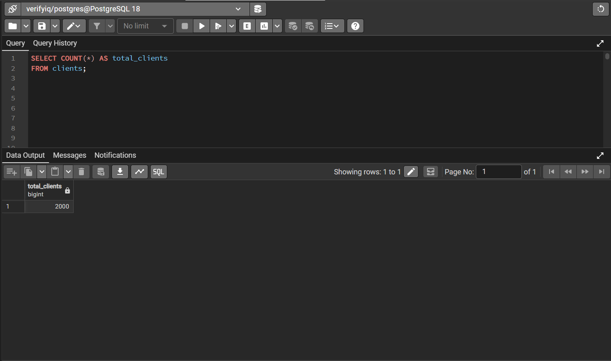
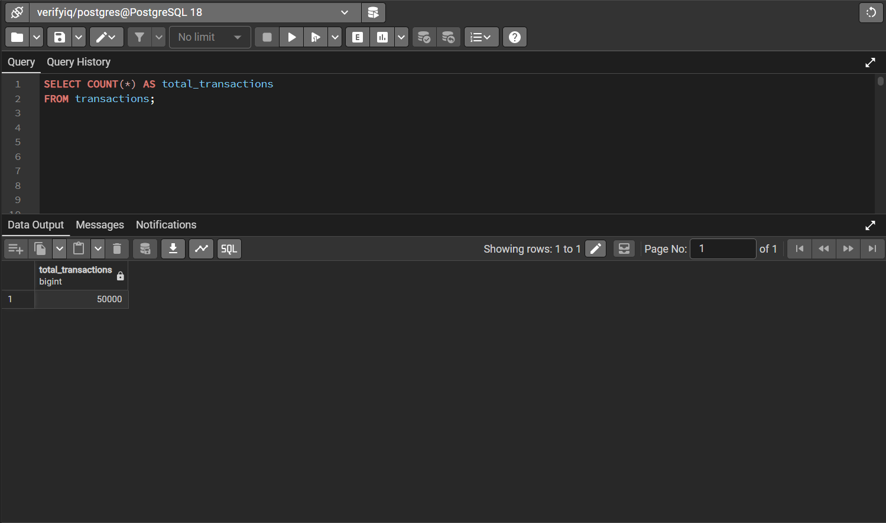
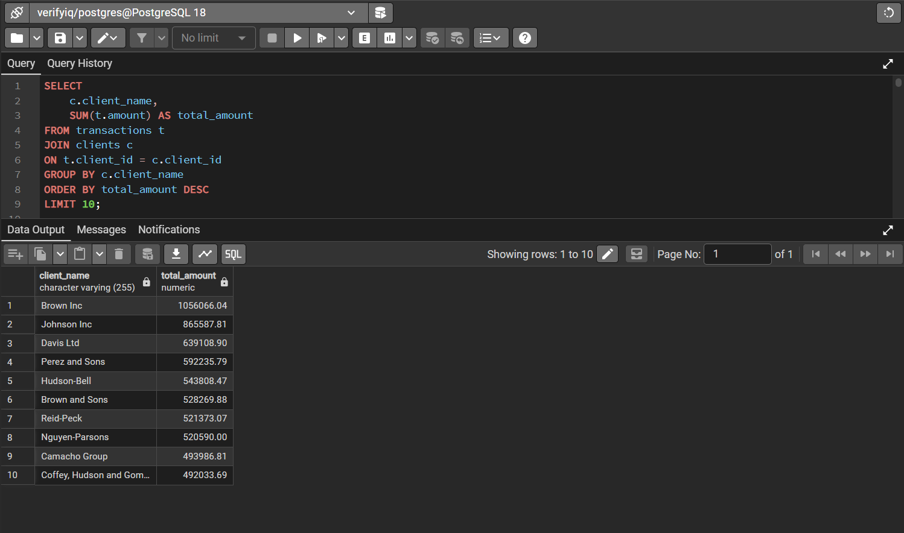

#  VerifyIQ — Customer Risk & Transaction Monitoring

A real-world inspired banking compliance analytics project built using SQL, PostgreSQL, Excel, and Power Query.

This project simulates how financial institutions monitor customer risk profiles, suspicious transaction behavior, and compliance exposure using data analytics.

---

# Project Overview

VerifyIQ simulates a customer risk monitoring system used in banking and financial compliance environments.

This project helps identify:

- High-risk customers
- Politically Exposed Persons (PEPs)
- Sanctioned customers
- FATF risk customers
- Suspicious transaction behavior
- High-value transaction anomalies

---

# Business Problem

Banks must continuously monitor customer behavior to detect fraud, compliance violations, and suspicious activity.

This project answers questions like:

- Which customers are highest risk?
- How many PEP customers exist?
- Are sanctioned customers active?
- Which customers moved the highest amounts?
- What suspicious patterns exist?

---

#  Tech Stack

- PostgreSQL
- SQL
- Excel
- Power Query
- CSV Data Cleaning
- Risk Analytics

---

#  Project Structure

```text
VerifyIQ-Customer-Risk-Monitoring
│
├── data
├── sql
├── screenshots
└── README.md






